# Donato's web Server
C server with sockets implementing the HTTP/1.1 protocol and file handling service.

Student: Gabriele Donato, Matriculation number: 31884A

## Configuration
To get started:
```bash
git clone https://github.com/GabrieleDonato799/DoS.git
cd DoS
make run
```

By default the server exposes resources under `localhost:3456/www/`.
Documents must be put under the public directory `content`.

The code is organized as follows:

```bash
project/
	bin/
		# executable
	main.c # listening process, forking, high level connection handling
	switcher.h
	switcher.c # request switching logic
	lib/
		# libraries
		httpproto/
			httpproto.h
			httpproto.c # HTTP 1.1 implementation
		lists.h
		lists.c # simple list implementation
	handlers/
		# request handlers / services implementation
		webserver/
			webserver.h
			webserver.c
		fileserver/
			fileserver.h
			fileserver.c
    content/
      # public content
```

To configure the services or the main server software, a basic internal configuration API is present.

### Required privileges
The server is executed as a normal user, running it under a dedicated user is recommended. The server will only bind not well-known ports. Services must have the necessary file system permissions and should follow the principle of least privilege.
## Architecture
### Concurrent server implementation with fork()
#### Components and Responsibilities
The *listening process*:  
receives connections from the clients and delegates their handling to worker processes. Configures the switching logic by binding endpoints to the request handlers.

The *worker process*:  
handles the connection with the client by parsing requests, then passing it to the request handler, indicated by the switching logic, and sending the response back to the client.

The *switching logic*:  
keeps the bindings between an endpoint and a request handler, determines which request handler must receive a request from a client. 

The *request handler*:  
implements the service logic, takes a request and builds a response, returned to the worker process for transmission.

The architecture is designed to work with and without permanent TCP connections.
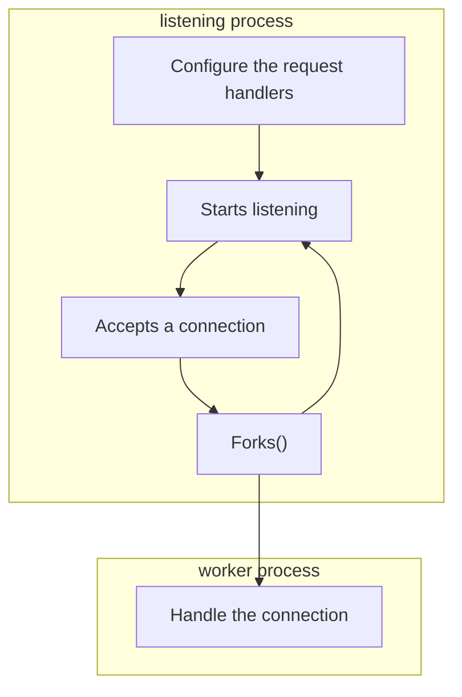
Follows the operations a worker process does when handling a single request.
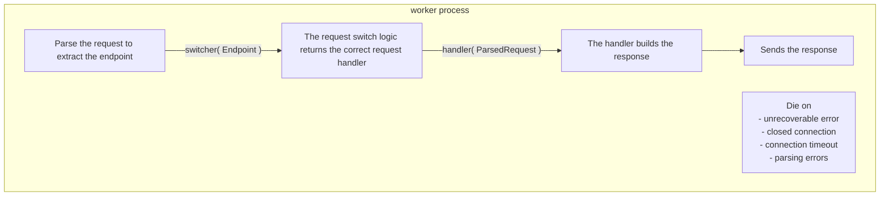
To distinguish between requests for different services, a request handler is bound to an endpoint.
####  Shared abstract data types
The endpoint to which the request handler is bound is not dependent on the service configuration itself, but depends on the server software configuration.
The scheme, host, port and path on which the service must be exposed are determined by the listening server process, on startup, long before a request handler receives data. Thus every request is handled with the same configuration.
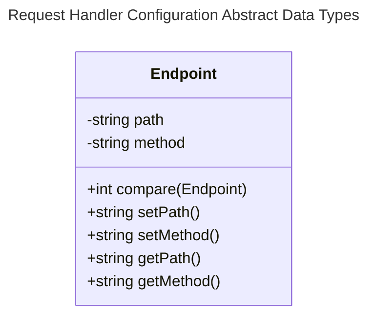
The bindings are managed with a simple list implementation as follows:
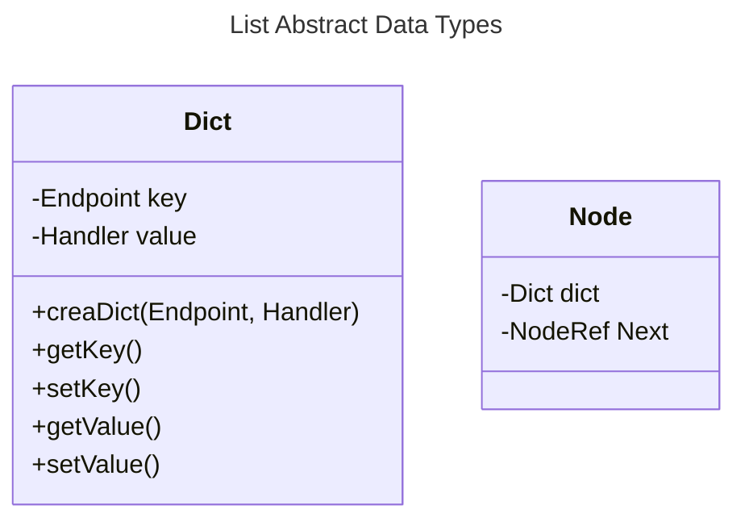

#### Switching logic
The switcher() returns a handler function exported by the request handler's module. The switching logic:
	- Determines which handler must receive the request, by comparing the endpoint to those of the bound handlers.
	- Simply returns the handler reference to the worker process (to enforce the principle of single responsibility).
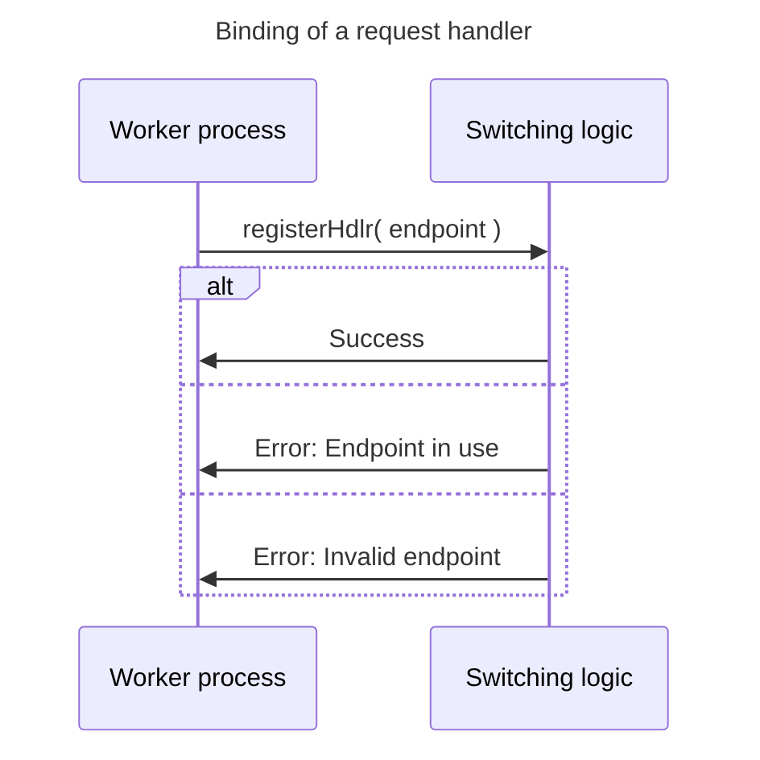

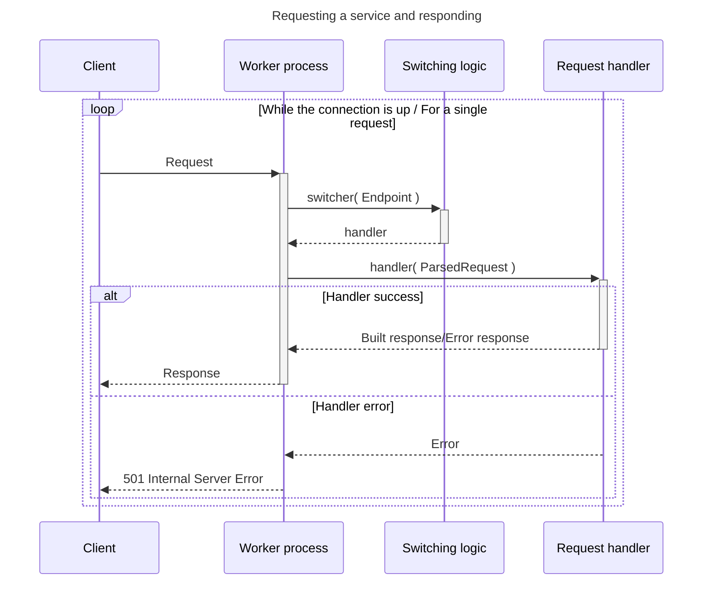
### Requests parsing and response building
The software can exclusively handle URLs in [origin form](https://developer.mozilla.org/en-US/docs/Web/HTTP/Guides/Messages#request_targets) (relative path to the Host header field).
A request handler needs the method to determine the type of action and the path to determine the target resource.
The request handler builds the response using the HTTPResponse primitives. Compares them by checking if they have the same path and method.
The HTTPRequest has a parse() primitive, for the worker process to parse it.
The HTTPResponse has a send() primitive, to hide the details of the transmission.

#### HTTP specific abstract data types
Objects are copied whenever possible.
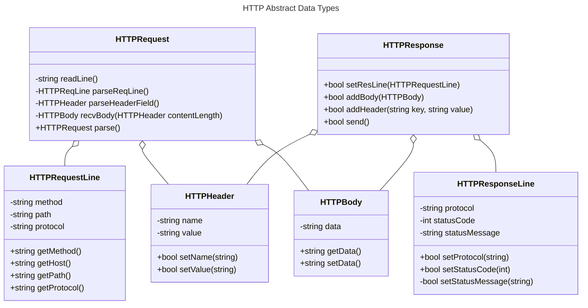
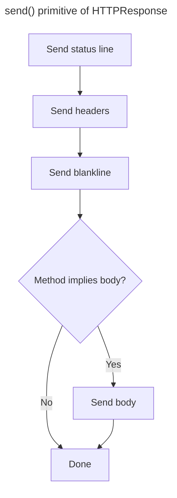
The parser logic is as follows:
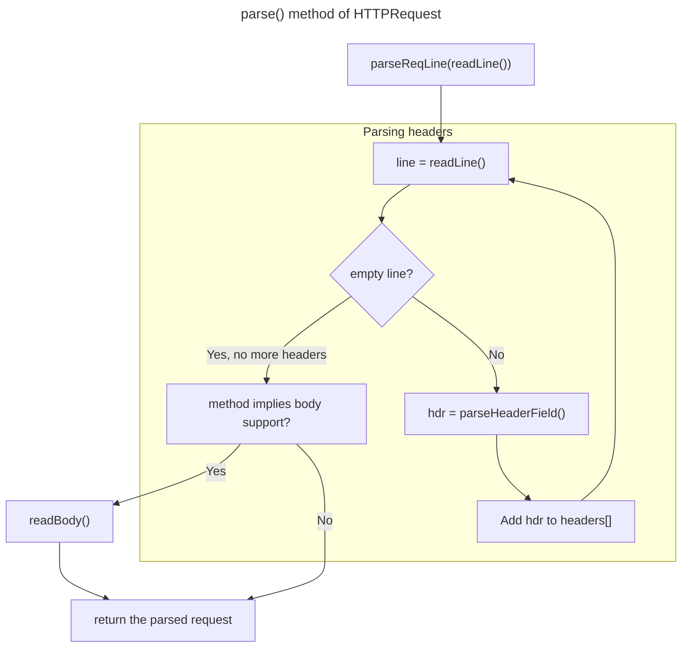
The readline() primitive abstracts away the details of the TCP connection stream and memory allocation and management of the receiver's buffer.
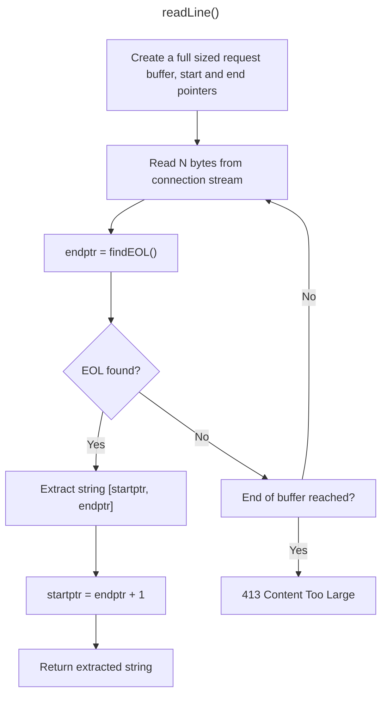
## Cookies
The server provides primitives to set and restore http headers. The usage of cookies is left to the specific request handler implementation.

## Services
Every service must be organized in a module that exports the required functionality.
The service are configured at startup by the listening process, by passing the endpoint configuration of the request handler to the switching logic.

#### URL's path to folder path translation
The translation of an URL's path to a folder path to access the actual document it is as follows:
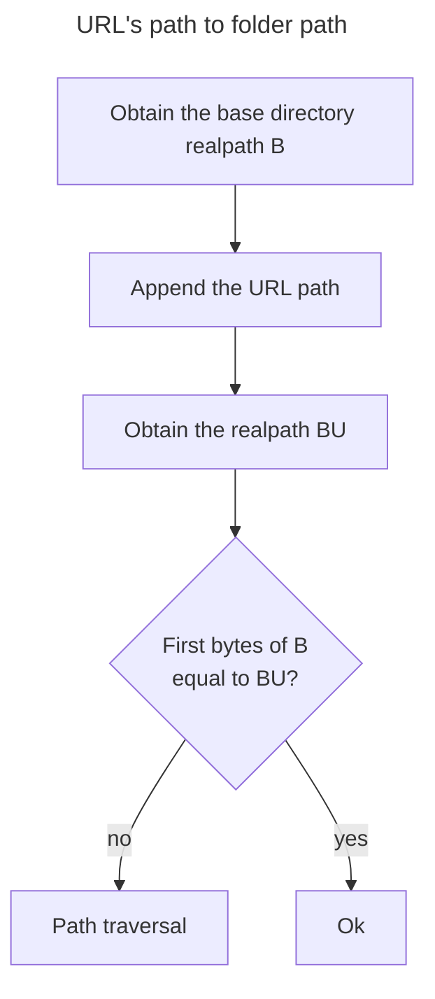

### Web server service
Exposes a public directory of web documents. Every file is a resource accessible from a specific path under the particular exposed folder, which is verified by the URL path translation logic.

### File service
This service exposes files for creation (POST), retrieval (GET/HEAD), edit (PUT), deletion (DELETE). Files are specified in the URL's path of the request.
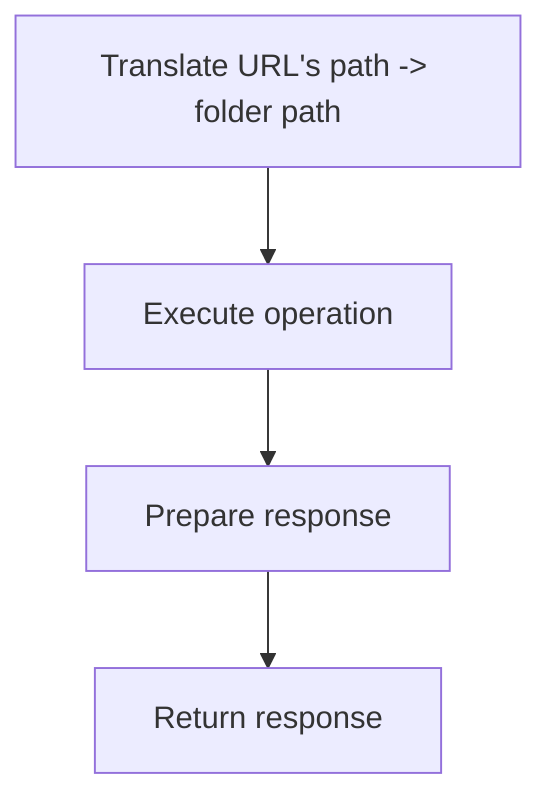

#### Browser caching
The file server tells the browser to cache a file for one hour as an example. It also provides the Last-Modified header, linked to the last modification time of the files.
